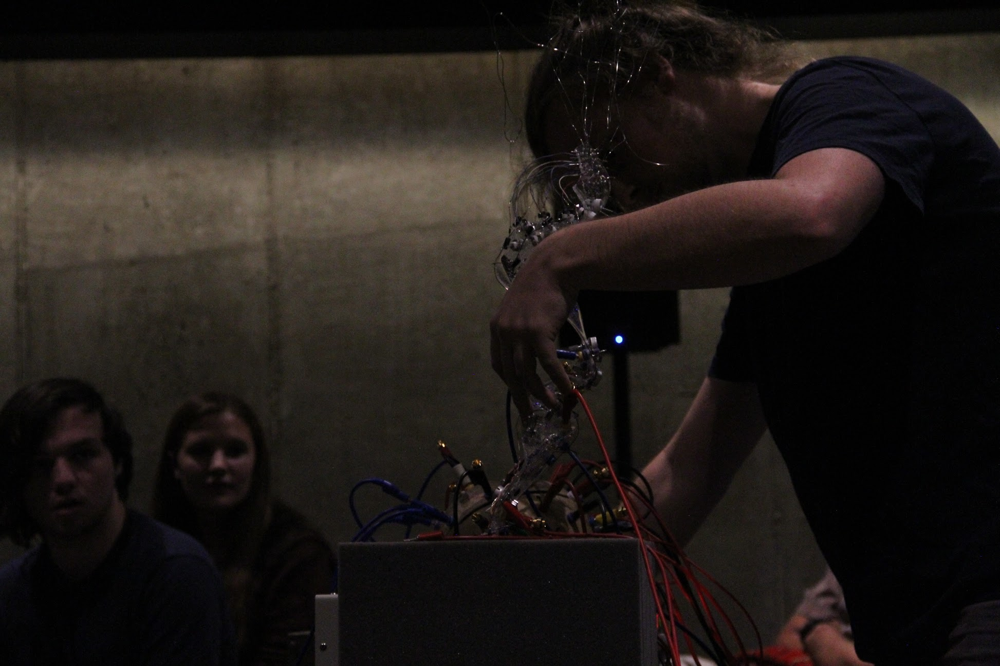
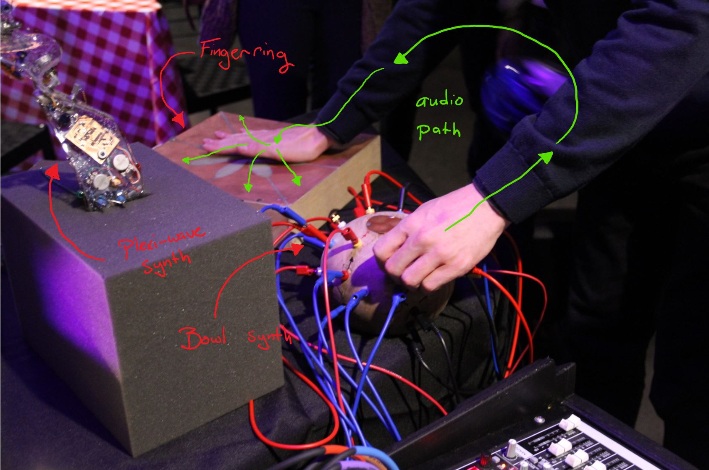

# Analog Synth Design

An image of me performing my self-designed analog synthesizers at the Crafting Sound Festivle, Oberlin 2019. 

## History

Before I became more focused on digital signal processing, I was first a devotee of analog audio. As a child I enjoyed taking apart consumer electronics to try to get and understanding of the innards. Later, in highschool and early college I worked to fix analog audio gear and began building some of my own. Over the past several years, I have worked to design my own analog synthesizers of various forms. My current research is deeply influenced by my love of analog and I hope to continue investigating the intersection of analog and digital audio. 

## Design Philosophy

When designing these synthesizers, I hoped to expirement with interfaces which allowed me to create interesting and meaningful gestures. When playing conventional analog synthesizers, I found the flat, two-dimensional, rectangular interface of most synthesizers to be unhelpful to creativity. Gestures consisted of simply twisting various knobs on a grid. I hoped to create synthesizer interfaces using the same elements, knobs and patch cables, but with unusual three-dimensional interfaces. By doing this, I hoped to make the process of performing the instruments to be more interesting. 

## The Human Body as a Patch Cable

In circuit bending, it is common to make metallic contacts avalible to be touched by the performer. The conductive nature of the human body is used to change the characteristics of the circuit. I integrated this as an intended element of my synthesizers, leaving metal contacts avalible to be touched by the user. By changing pressure and surface area contact with the metal, it changes the impedence of the connection between them formed by the human body. This property can be used to create more complex textures while performing, similar to how bow pressure can be manipulated by string players. I found this tactile aspect of to be very manipulatable and beautiful. 

### The Fingerring

The main output of the synthesizer is the *Fingerring*, an interface designed by Sergy Casich. ([link](http://soundartist.ru/sa-projects/fingerring/)) It uses this conductive property of the human body to spacilize sound live to eight channels. Each pad is connected to a speaker placed in an octogon around the space. The user "grabs" a sound from an audio source with one hand and then spacalizes it by touching any number of pads. Audio, in the form of electricity, flows through the body and into the speakers corresponding to the touched pads. 
