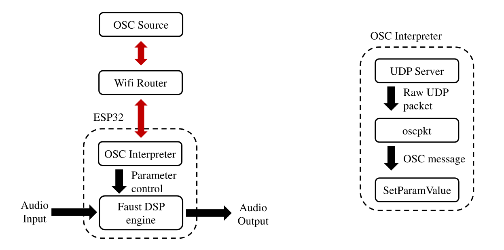

# ESP-32 Embedded Faust Project (2019 - Present)

## Overview

Working on the ESP-32 to create embedded audio effects was the subject of my Junior project for my TIMARA (Technology in Music and Related Arts) major. 
The project seeks to create an easy to use and affordable platform for real-time embedded low-latency audio effects on a microcontroller. 
It is part of a larger project working to run Faust code on various embedded platforms. An overview of the project can be found. 
Included, find a paper detailing a broad overview of the project, Michon et. al. *Embedded Real-Time Audio Signal Processing with Faust*, which was presented and IFC20 (International Faust Conference 2020).

I worked to create architectural C++ code which would extend the capabilities of the ESP-32 in various ways.
Many of the elements included here have been integrated into the Faust architectures (found [here](https://github.com/grame-cncm/faust)) and were designed to be accessed automatically during compilation. 

## OSC over WiFi

One of my major contributions is parameter control of the DSP algorithm through Open Sound Control (OSC) over Wifi. 
This allows for easy creation of networked audio effects or sources at a price of $10 per channel / $20 per node. 
Each node can be controlled independently using a single OSC controller (MaxMSP, Pure Data, etc.) simply by changing port addressing. 
Considering price point and scalability, this implementation the potential to create complex many-channel audio installations. 

### Implementation Details

The ESP-32 is connected to a WiFi network and configured as a udp server. Any device on the network can communicate with the UDP server by sending packets to the correct IP address and port. The UDP server is configured to interpret packets as OSC data using [oscpkt](http://gruntthepeon.free.fr/oscpkt/), an OSC interpreter written in C++. Incoming OSC messages are configured to communicate with the Faust DSP task via the Faust API, MapUI. 

### Further Documentation

This project was the subject of my Junior Presentation "Making Microcontrollers Sing: Embedded Audio on the ESP32". I've included presentation slides for reference. 

I have implemented this in my personal free-improvisation setup as a rapid prototyping method for digital pedals. 
I create audio effects in Faust, embed them on the ESP-32, and then control them using Max MSP. Thus, I can test various audio effects with no investment of hardware. 
Shown [here](https://photos.app.goo.gl/VBJGEGQxdWUHnu1MA) is a simple video demonstration of a reverb effect running within my setup. 

Integration of the OSC code into existing Faust Architectures is currently pending. 

## i2c Drivers

Another of my major contributions was the writing of various i2c drivers. These drivers allow for the support of additional audio development platforms and functionality. 

I worked to write a es8388 driver, which allows the support of the [LyraT](https://www.mouser.com/ProductDetail/Espressif-Systems/ESP32-LyraT?qs=MLItCLRbWsxPzPCja546ZA%3D%3D) within the Faust architectures, an audio development board designed by [espressif](https://www.mouser.com/manufacturer/espressif/). 
The current implementation can be found [here](https://github.com/grame-cncm/faust/tree/master-dev/architecture/esp32/drivers).

I also developed a driver for the MPU9250, an accelerometer found on the [TTGO-Taudio](https://github.com/LilyGO/TTGO-TAudio), another audio development board.
This code has been implementaed as part of the [Gramophone project](https://www.amstramgrame.fr/) (link in French). The project seeks to introduce DSP programming to young-adults in primary school. 
