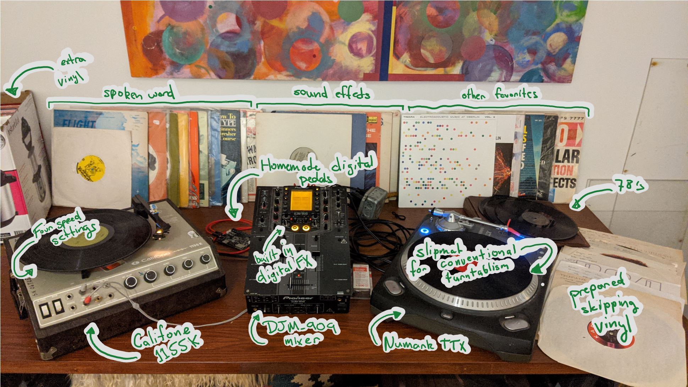

# Free Improvisation

Beginning my first year of College, I've been active as a free improvisor. I primarily perform using extended technique turntablism, though my exact setup is flexible. I've performed both as a soloist and as part of ensembles. 

## Recordings

### Improvisation 1

This improvisation is a recording of a virtual performance on 11/20/20. The recording is a fully free duet with my teacher, Dana Jessen on bassoon. We performed remotely via Sonobus. 

[link](https://drive.google.com/file/d/1RDpxTgqSibKAB49tgzI2PobcSDGOGked/view?usp=sharing)

### Exploration

For a bit more context on my technique, I've included a video excerpt of one of my regular practices, slowly exploring different textures and gestures. Skip around to get an idea of soundworld diveristy or watch through to get an idea of my exploration process. 

[link](https://drive.google.com/file/d/11UGMaURoLligMwAK7vbd5k-I6w3J0OJr/view?usp=sharing)

## My Current Setup

