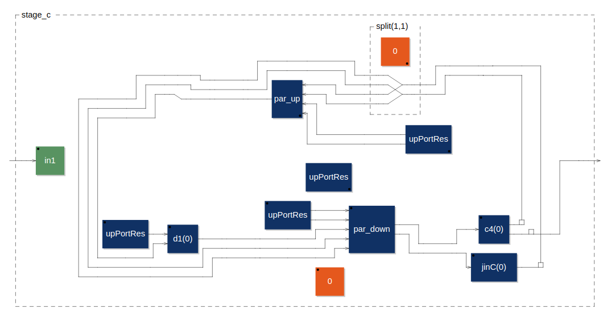
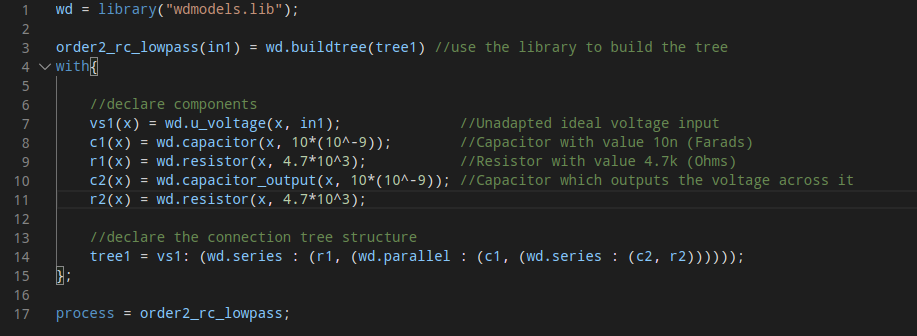

# Wave-Digital Modeling Library

*The Faust block diagram describing the final stage of a Ibanez Tube Screamer wave-digital model I created using my library.*

## Overview

Wave digital models are the subject of my current research. I have worked to create a Faust library facilitating the easy creation of wave-digital models. It an easy way for artists to create, prototype, and circuit-bend wave digital models of analog audio circuits. 

The library is designed around a novel implementation of wave-digital models which I have developed. I used Faust's functional programming capabilities to create a meta-language to specifically describe wave-digital models and represent the wave-digital connection tree.

The library is currently published as part of the [faustlibraries](https://github.com/grame-cncm/faustlibraries) open source project. 

My current work focuses on creating a state-space representation of my novel implementation and working to extend the capabilities of the library. 

### Brief Wave-Digital Model Overview

Wave-digital models provide a method for creating virtual-analog models of audio circuitry which can be run in real-time. The circuit is transformed from the Kirchhoff Domain to "Wave Domain"; rather then representing the system state with currents and voltages at various nodes, instead the system is described using "waves" (typically voltage waves) which travel between "adaptors." Adaptors describe the behavior of circuit elements in the wave domain with simple digital signal processing (DSP) algorithms. Thus, each simple circuit component is replaced by its respective adaptor which. The circuit's topology is treated as a graph and broken down into parallel, series, and rigid adaptors using SPQR graph decomposition. This process produces a "Connection Tree" of adaptors which describes the complete wave-digital model. Modeling non-linear elements, such as transistors and op-amps, requires more complex treatment. 

Wave digital models require no knowledge of circuit behavior to model, only circuit composition. 
It also maintains the discrete nature of analog circuits; users can easily modify component values or change circuit topology without having to fully re-derive a model. 
This opens the technique up to the possibility of digital circuit bending and modification of circuits. 

For a comprehensive description of the modeling method, see [Kurt Werner's thesis](https://searchworks.stanford.edu/view/11891203), *Virtual Analog Modeling of Audio Circuitry Using Wave Digital Filters*.

### Brief Faust Overview

"Faust (Functional Audio Stream) is a functional programming language for sound synthesis and audio processing with a strong focus on the design of synthesizers, musical instruments, audio effects, etc." (from https://faust.grame.fr)  
Faust provides a platform suitable for both artists and audio programmers. It is capable of generating code which is optimized to run complex algorithms in real time, a necessity for physical modeling techniques. Furthermore, users can easily run their Faust code in external programs using the "faust2..." tools. These create platform specific implementations of Faust code, such as plugins, max externals, binaries for embedded devices, among others.

For further information on Faust, see [Faust Documentation](https://faustdoc.grame.fr).

## Examples

To experiment with the library, you can find the implementations mentioned in this document at these links

[Ibanez Tube Screamer](https://faustide.grame.fr/?autorun=1&voices=0&name=tubeScreamer&inline=aW1wb3J0KCJzdGRmYXVzdC5saWIiKTsKCndkID0gbGlicmFyeSgid2Rtb2RlbHMubGliIik7CgpzdGFnZV9hKGluMSkgPSB3ZC5idWlsZHRyZWUodHJlZV9hKQp3aXRoewogICAgdmluQShpKSA9IHdkLnVfcmVzVm9sdGFnZShpLCAxLCBpbjEpOwogICAgYzIoaSkgPSB3ZC5jYXBhY2l0b3IoaSwgMSoxMF4tNik7CiAgICB2QihpKSA9IHdkLnJlc1ZvbHRhZ2Vfb3V0cHV0KGksIDEwKjEwXjMsIDQuNSk7CiAgICByQShpKSA9IHdkLnJlc2lzdG9yKGksIDIyMCk7CgogICAgdHJlZV9hID0gdmluQSA6IHdkLnNlcmllcyA6IChjMiwgKHdkLnNlcmllcyA6IChyQSwgdkIpKSk7IAp9OwoKCgpzdGFnZV9iKGluMSkgPSB3ZC5idWlsZHRyZWUodHJlZV9iKQp3aXRoewogICAgdmluQihpKSA9IHdkLnVfdm9sdGFnZShpLCBpbjEpOwogICAgYzMoaSkgPSB3ZC5jYXBhY2l0b3IoaSwgLjA0NyoxMF4tNik7CiAgICByNChpKSA9IHdkLnJlc2lzdG9yX291dHB1dF9jdXJyZW50KGksIDQuNyoxMF4zKTsKCiAgICB0cmVlX2IgPSB2aW5CIDogd2Quc2VyaWVzIDogKGMzLCByNCk7IAp9OwoKCnN0YWdlX2MoaW4xKSA9IHdkLmJ1aWxkdHJlZSh0cmVlX2MpCndpdGh7CiAgICBwb3QxID0gaHNsaWRlcigiZGlzdG9ydGlvbiAwIC0gNTAwayIsIDI1MCwgMCwgNTAwLCAuMSk7CiAgICBqaW5DKGkpID0gd2QucmVzQ3VycmVudChpLCA1MSoxMF4zK3BvdDEqMTBeMywgaW4xKTsKICAgIGQxKGkpID0gd2QudV9kaW9kZUFudGlwYXJhbGxlbChpLCAyLjUyKjEwXi05LCAyNS44NSoxMF4tMywgMSwgMSk7IAogICAgYzQoaSkgPSB3ZC5jYXBhY2l0b3Jfb3V0cHV0KGksIDQxKjEwXi0xMik7CgogICAgdHJlZV9jID0gZDEgOiB3ZC5wYXJhbGxlbCA6IChjNCwgamluQyk7IAp9OwoKaW5nYWluID0gaHNsaWRlcigiaW5wdXQgZ2FpbiIsIDEsIDAsIDEsIC4wMSk7CgppbnB1dHByb3RlY3QoaW4pID0gaW4qKChpbiA8IGNsaXApICYgKGluID4gLWNsaXApKSArIGNsaXAqKGluID4gY2xpcCkgKyAtY2xpcCooaW4gPCAtY2xpcCkKd2l0aHsKICAgIGNsaXAgPSAuMDE2Owp9OyAKCm9uU3RhdGUgPSBjaGVja2JveCgiT04iKTsKZ2FpbmNvcnJlY3QoaW4pID0gIGluKihvblN0YXRlKi0xICsgMSkqMTIgKyBpbjsKCnByb2Nlc3MgPSAgXyouMDE1KmluZ2FpbiA6IGlucHV0cHJvdGVjdCA6ICBzdGFnZV9hIDw6IF8sIHN0YWdlX2IgKiBvblN0YXRlOiBfLCBzdGFnZV9jIDogXyAtIF8gLSA0LjUgOiBnYWluY29ycmVjdCA8OiBfLCBfIDsgCgoKCg%3D%3D)

[Second Order RC Filter](https://faustide.grame.fr/?autorun=1&voices=0&name=rcfilter_secondorder&inline=d2QgPSBsaWJyYXJ5KCJ3ZG1vZGVscy5saWIiKTsKCm9yZGVyMl9yY19sb3dwYXNzKGluMSkgPSB3ZC5idWlsZHRyZWUodHJlZTEpIC8vdXNlIHRoZSBsaWJyYXJ5IHRvIGJ1aWxkIHRoZSB0cmVlCndpdGh7CgogICAgLy9kZWNsYXJlIGNvbXBvbmVudHMKICAgIHZzMSh4KSA9IHdkLnVfdm9sdGFnZSh4LCBpbjEpOyAgICAgICAgICAgICAgLy9VbmFkYXB0ZWQgaWRlYWwgdm9sdGFnZSBpbnB1dAogICAgYzEoeCkgPSB3ZC5jYXBhY2l0b3IoeCwgMTAqKDEwXi05KSk7ICAgICAgICAvL0NhcGFjaXRvciB3aXRoIHZhbHVlIDEwbiAoRmFyYWRzKQogICAgcjEoeCkgPSB3ZC5yZXNpc3Rvcih4LCA0LjcqMTBeMyk7ICAgICAgICAgICAvL1Jlc2lzdG9yIHdpdGggdmFsdWUgNC43ayAoT2htcykKICAgIGMyKHgpID0gd2QuY2FwYWNpdG9yX291dHB1dCh4LCAxMCooMTBeLTkpKTsgLy9DYXBhY2l0b3Igd2hpY2ggb3V0cHV0cyB0aGUgdm9sdGFnZSBhY3Jvc3MgaXQKICAgIHIyKHgpID0gd2QucmVzaXN0b3IoeCwgNC43KjEwXjMpOwoKICAgIC8vZGVjbGFyZSB0aGUgY29ubmVjdGlvbiB0cmVlIHN0cnVjdHVyZQogICAgdHJlZTEgPSB2czE6ICh3ZC5zZXJpZXMgOiAocjEsICh3ZC5wYXJhbGxlbCA6IChjMSwgKHdkLnNlcmllcyA6IChjMiwgcjIpKSkpKSk7Cn07Cgpwcm9jZXNzID0gb3JkZXIyX3JjX2xvd3Bhc3M7)

These will take you to a web version of the Faust IDE which can run Faust projects in the browser. Project specific controls and diagrams can be found in the lower central tab. Audio source controls can be found in the top right corner. 

NOTE - At current time of writing, the IDE has not been rebuild to reflect changes in the Faust Libraries. I've included a version of the library with which this code was runs. If the linked code does not compile or produces errors, download 'wdmodels.lib' from this folder and drag it into the file browser on the web IDE. 

## Designing the Library for Accessibility

*Faust code implementing a second-order passive low-pass filter circuit using my WDF library. It consists of two resistor-capacitor pairs in a ladder configuration.*

Wave-digital modeling is a complex technique which often requires extensive knowledge to preform. With this library, I worked provide an implementation of wave-digital models which allows those who are unfamiliar with the technique to investigate it for the first time. Simple use of the library only requires a high-level understanding of the technique.

The library itself is very simple to use. Each adaptor can be accessed as a separate function, allowing user to declare circuit components. These are then configured into a representation of the connection tree (more info on this representation can be found [here](https://github.com/droosenb/faust-wdf-library#trees-in-faust)). The user passes the connection tree to the libraries build functions, which act on the user-declared connection tree to build the corresponding DSP algorithm. 

This implementation abstracts away the need for extensive knowledge of the direct behavior of adaptors or overall model behavior. The user only needs to derive the corresponding connection tree from an audio circuit schematic. Furthermore, the user can also explore Faust block diagram to learn how the model is computed. 

Prior to this library, similar wave digital modeling libraries were limited to Matlab and C++. Matlab cannot perform real-time audio computation; furthermore, real-time audio implementation in C++ has a very steep learning curve and remains inaccessible to non-audio programmers, i.e. artists. Thus, the technique has largely found use among professionals and academics. 

## Novel Developments

In order to create a wave digital modeling library in Faust, I had to develop a novel implementation technique for wave-digital models. Most implementations in C++ involve deceleration of the connection tree. At runtime, a full tree traversal must be performed in order to compute a single sample. 

In Faust, I used functional programming and Faust's block diagram algebra (BDA) to create a "meta-language" within Faust which describes the tree structure. The user declares a symbolic tree based on their connection tree, linking to declared components. Functions then act on that symbolic tree at compile time, arranging the connections and creating a single function. This function is a single instructional state-update equation which corresponds to the model. 

## Future Research

My current work focuses on translating the novel implementation in the library into a fully formed state-space representation of wave-digital models. Currently, I am working to refine my description of my implementation (which at first was described in Faust's block diagram algebra system) using linear algebra. The result can be translated into the desired state-space model representation.  

I am working with Kurt Werner and Julius O. Smith III to refine and publish my preliminary results. We are hoping to publish this state-space description of the connection tree based implementation of wave digital models, an alternative to Sarti and De Sancits's state-space wave-digital description, the wave tableau method. (Sarti, De Sancits, *Systematic Methods for the Implementation of Nonlinear Wave-Digital Structures*. We hope that this state-space representation could be used to deepen understand of wave-digital models through comparison of wave-digital modeling methods with other state-space discrete virtual-analog methods, such as those described in Holterz and Zolzer *A Generalized Method for the Derivation fo Non-Linear State-Space Models from Circuit Schematics*  and Yeh et al. *Automated Physical Modeling of Nonlinear Audio Circuits for Real-Time Audio Effects - Part I & II*

I am also working to create tools which make the creation of R-type adaptors much simpler. I am hoping to make available a program can generate R-type adaptors from a nodal description of the elements. I also hope to use this to generate the adaptors corresponding implementation in my library. This would greatly expand the current capabilities of the library, allowing modeling of more complex circuits. 
